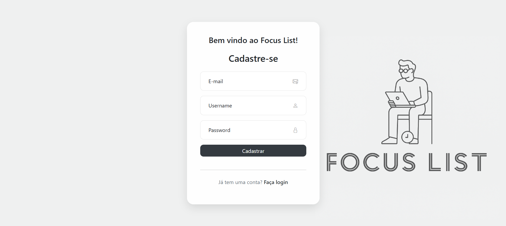
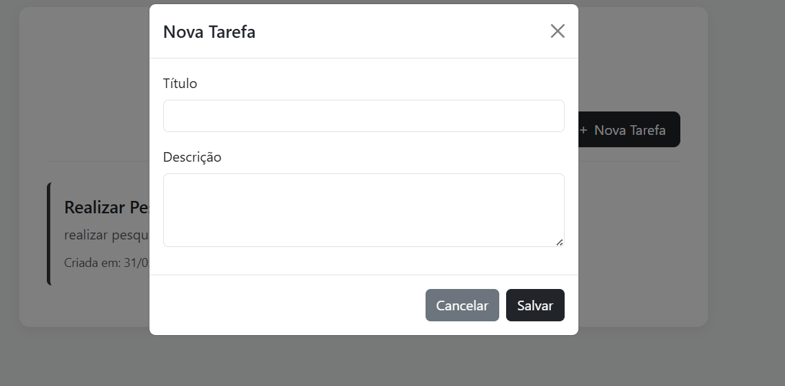

# 📌 FocusList - Gerenciador de Tarefas com Autenticação

<p align="center">
     <br>
    
    
</p>
FocusList é uma aplicação web desenvolvida com arquitetura MVC que permite aos usuários se cadastrarem, fazerem login e gerenciarem suas tarefas pessoais de forma segura e intuitiva.

## 📷 Visão Geral

A proposta do projeto surgiu a partir da junção de dois sistemas sugeridos: um gerenciador de tarefas e um sistema de autenticação simples. O resultado é uma plataforma onde cada usuário tem acesso exclusivo às suas próprias tarefas, garantindo segurança e organização.

## 🚀 Funcionalidades

- ✅ Cadastro de novos usuários
- 🔐 Autenticação e login de usuários
- 🗂️ Criação de tarefas
- ❌ Exclusão de tarefas
- 👤 Vínculo exclusivo entre usuário e tarefas
- 🔒 Controle de acesso por sessão (somente o usuário logado visualiza suas tarefas)

## 🧱 Arquitetura

O projeto segue o padrão **MVC (Model - View - Controller)**, promovendo separação de responsabilidades e facilidade na manutenção do código.

## 🛠️ Tecnologias Utilizadas

### Back-end
- **Java 21**
- **Spring Boot**
- **Spring Data JPA**
- **Spring Security**
- **Map-Struct**
- **Hibernate**
- **Banco de dados PostgreSQL**

### Front-end
- **HTML5**
- **CSS3**
- **Bootstrap**
- **Thymeleaf**

## 📁 Estrutura de Pastas

```
src/
├── main/
│ ├── java/
│ │ └── com.architeturemcv.login
│ │ ├── configuration/
│ │ ├── controller/
│ │ └── dtos/
│ │ └── mappers/
│ │ ├── model/
│ │ ├── repository/
│ │ ├── security
│ │ ├── service/
│ └── resources/
│ ├── static/
│ ├── templates/
│ └── application.yml
```
## Evidências visuais

- **tela de cadastro:**



- **tela de login**


- **tela de tarefas**


- **nova tarefa**


## Desenvolvimento

- Samuel Monteiro Ferreira